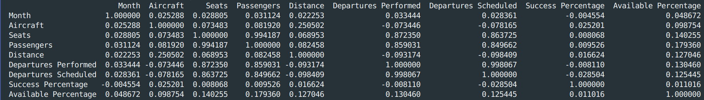
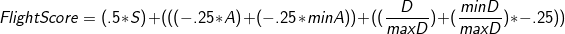
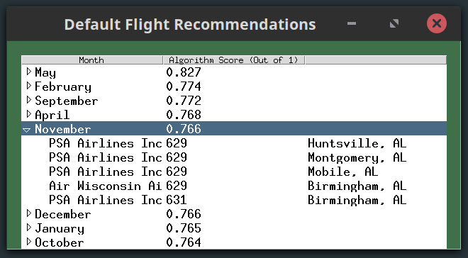
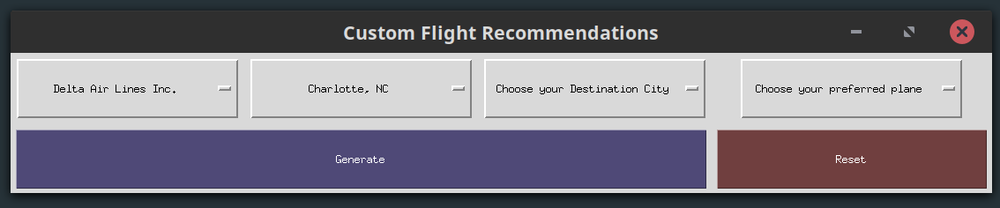
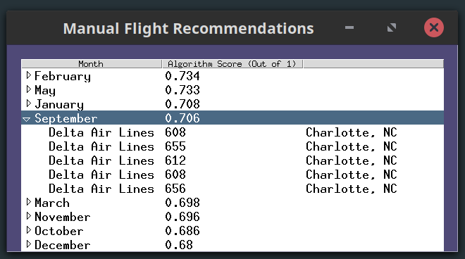

# flight-recommendations
A python program that recommends flights by carrier based on data given for South Carolina and North Carolina in 2018

## Environment
This program uses Python 3.6.7 with tkinter as my Graphical User Interface (GUI). The pandas library is used for `.csv` intake and manipulation. The OS package is used to check for an existing file before running the `smallerDF()` function. The `calendar` package is used to call the function `month_name` to convert month numbers to their names. The Python datetime library is used to convert given month numbers back to their month names when needed.

## Intial Run
The first time this project is run with `python3 main.py`, the program should read from the larger dataset 
and create the smaller one. Every run after that should read from the smaller data set file and not need the larger one. 
This is done to decrease the reading and compute time required on larger .csv files. 

## Developing the Program
This entire program was developed and run completely from my laptop. I have previous experience with Python and using the Pandas library so, I defaulted to using that for reading and manipulating the `.csv` right away. I started by narrowing down the very large dataset to something much smaller and more manageable. My program does this on first run by default now.

Once I was able to print out the data I wanted to the console, I began work on the GUI, displaying buttons for the user and tables for the results. I first made the dropdown tables for the manual mode because I knew how to do that easily. I soon switched to developing the automatic flight selection portion of my application. Given that the tkinter documentation is sparse and not very thorough, I struggled a lot at first with geting a TreeView to show all of my data. 

Once the automatic section was done and I was able to list 5 flights for each month, the manual section was as simple as filtering down the dataset on the user's given input and then running that dataset through the algorithm and TreeView functions. Lots of code reuse to produce very different results!

## Algorithm Explanation
I first started developing my algorithm by developing a correlation chart using the `Pandas.corr` function. This would provide me a Dataframe that showed the correlations between all of the columns in my dataset. 

From my correlation chart, I could see that none of the provided columns had any strong correlation with the success or failure of a flight. This meant that adding any of the columns into consideration for my algorithm would not positively or negatively affect a month's score. For example, the distance column had a positive correlation of .14 with the Success Percentage of a flight. This meant that as the distance of the flight increased, the more likely it succeeded. This is an interesting observation, but the correlation score is on a scale of -1 (negatively correlated) to 1 (positively correlated) so, the .14 is not enough to be considered a huge influence on the Success Percentage of the flight.

In order to add more conditions to my algorithm, I went ahead and added in the distance for each flight as well and assumed that a customer of the program would want to take the shortest flight possible. My projects algorithm is represented as a math equation below: 
<br/>


Where 
```
S = the success percentage of the flight  
A = the available percentage of seats for the flight  
minA = the minimum avaible seating for all flights  
D = the distance the flight will travel  
maxD = the max distance of all flights  
minD = the minimum distance of all flights
```

As stated above, I assume the customer only wants to travel the minimum amount of distance on their flight. So, my algorithm subtracts from the overall algorithm score the distance factored by .25. This is the same for Available Seats. It is assumed the customer will have a better chance of getting on a flight if their are more seats available so, the algorithm subtracts the percentage of available seats from the overall score by another factor of .25. The success percentage of a flight is very much crucial in providing a successful flight to the customer so, my algorithm adds the percentage of the Successful flights to the overall score by a factor of .5. 

The overall distance and available seats fields are adjusted by the minimum amount of distance and seats available over all flights. This is to create the perfect range of scores between 0 and 1 since no flights will have the statistics under the minimum score. The automatic and manual modes both run their datasets through this algorithm to get a score for each available flight and statistics for the month in total.


## Intermediate and Supporting Files
`ProjectData.csv` is filtered down into `filtered_data.csv`. `filtered_data.csv` only contains the necessary columns for this project. I saw this necessary in order to decrease computation time of the project. This would also help if the project was ever scaled up and given data from the entire United States (instead of just South Carolina and North Carolina).

## Explanation of Automatic Mode
The automatic, or "default", section of my program will start with the full dataset and run it through the described algorithm. A newly created dataset be produced and contain each month, sorted by their algorithm score. Other columns in the new dataset include the Average Success Percentage of flights that month, the average available seats, and the average distance for that month. 

This new dataset will be fed through a treeview to display the month and its algorithm score. While looping through each month, the program will pull out 5 flights from that month and populate those as children of the month in the treeview. All of this is displayed in a final File Explorer like GUI:
<br/>



## Explanation of Manual Mode
The manual, or "custom", section of my program will start by prompting the user with a set of dropdown that allow them to filter the dataset on the columns "Airline", "Origin City", "Destination City", and "Flight Number". Once the user has made their choices they can hit the generate button and the full dataset will be filtered down by any combination of given criteria. The user has the choice to leave any fields blank and it will still generate a report on just the criteria that was given. The user also has the option of a "Reset" button that will reset the GUI and allow for new picking of criteria.
<br/>


The new and filtered dataset is now run through the mentioned algorithm and same GUI function as the automatic mode. This decreases the amount of code written dramatically while still offering the desired results. It is important to note that if the user's given criteria results in no matches within the large dataset, the program will remove criteria until it has a data set with data in it.

For example, if the user gives "Delta Air Lines" with an Origin City of "Charlotte,NC" and a destination of "Atlanta,GA" on plane number "677", the dataset will return nothing because there are no flights matching that plane number. So, the code will exclude the plane number and search for Delta Airlines flights with Origin City "Charlotte, NC" and Destination City "Atlanta,GA."
<br/>



## Testing and Validation
There is not much need for input validation in my project as there are no opportunities for the customer to input custom data. Everything input section for the customer is pre-populated with valid data from the dataset itself. If the user were to give enough criteria that there would be no matches for their search in the dataset, the program would automatically back up on criteria until it finds a combination of given criteria that does have data.

Other testing of my program included multiple run throughs of my program and providing multiple different combinations for the algorithm to work through. Clicking all of the buttons and scrolling through all of the option menus to make sure everything worked correctly.

## Acknowledgements
* Pandas Documentation
* Tkinter Documentation (Where I could find it)
* Antonio for his ttk styling recommendation
* George for his ComboBox recommendation